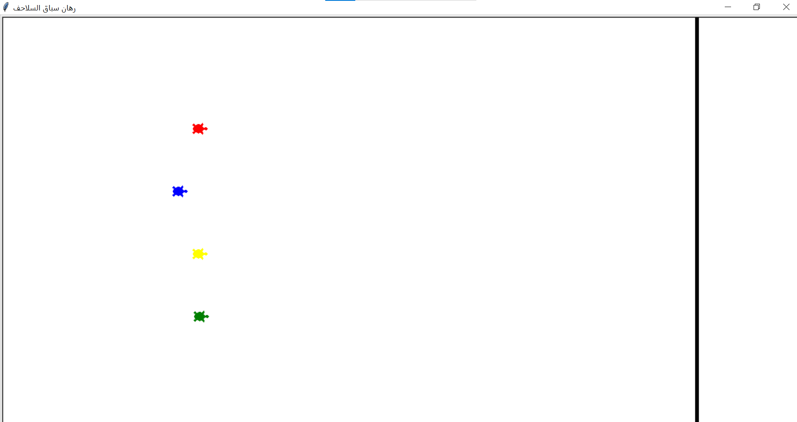

## 🐢 Turtle Race Game

A fun and interactive Python game built with the **turtle graphics library**, where colorful turtles compete in a race.  
Cheer for your favorite turtle and see who crosses the finish line first! 🎉

---

## 🚀 Features
- Multiple turtles with random colors  
- Randomized race outcomes for extra fun  
- Beginner-friendly project using Python's `turtle` module  
- Lightweight and easy to run on any machine with Python installed  

---

## 🎮 How to Play
1. Clone the repository:
   ```bash
   git clone https://github.com/username/Turtle-Race-Game.git
   cd Turtle-Race-Game
   python main.py
   Watch the turtles race and enjoy! 🐢🏁
## 📸 Demo



## Turtle-Race-Game/
│
├── src/
│   └── main.py          # The main game code
├── assets/
│   ├── turtle.ico       # Game icon
│   └── demo.png         # Screenshot 
├── .gitignore           # Ignore unnecessary files
├── README.md            # Project description
└── LICENSE              # License file (MIT)
## License

This project is licensed under the MIT License - see the [LICENSE](LICENSE) file for details.

---

## Contributing

Contributions are welcome! Feel free to open issues or submit pull requests.

---

## Acknowledgments
Developed using Python and the Turtle graphics library.

